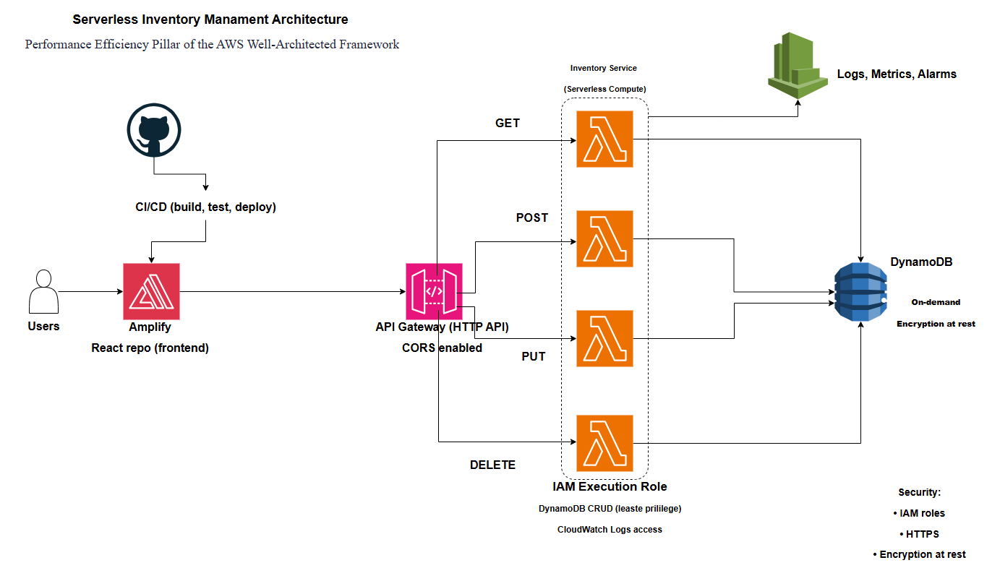
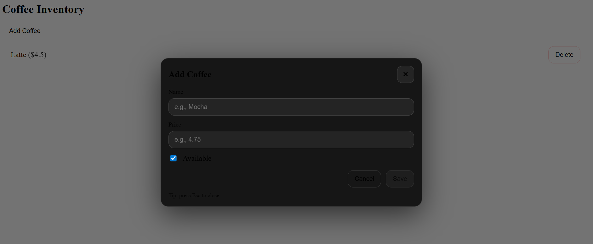
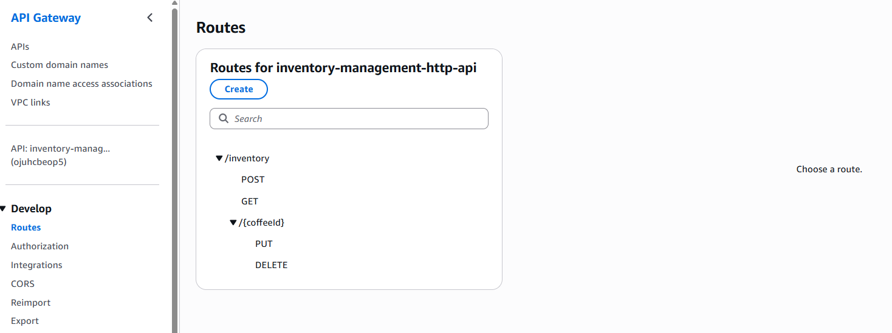

# Serverless Coffee Inventory Management System

This project is a full-stack serverless app for managing a coffee inventory system. It shows how a modern frontend can work with a scalable cloud backend using AWS serverless services.

Users can add, view, update, or delete coffee inventory items through a simple web interface. The frontend connects to a REST API on Amazon API Gateway, which in turn calls AWS Lambda functions to handle business logic and store data in Amazon DynamoDB.

This project aims to show a practical serverless setup and highlight frontend development, backend API design, and infrastructure-as-code skills for DevOps and cloud engineering portfolios.

------------------------------------------------------------

## ARCHITECTURE

The application follows a serverless architecture using AWS managed services.

React Frontend  
      │
Amazon API Gateway (HTTP API)
      │
AWS Lambda Functions
      │
Amazon DynamoDB

The frontend sends HTTP requests to API Gateway. API Gateway routes the requests to Lambda functions. Lambda processes the request and interacts with DynamoDB for persistent storage.

------------------------------------------------------------

## FEATURES

- Create coffee inventory items  
- Retrieve inventory list  
- Delete coffee items  
- Update coffee items  
- Modal-based user interface for adding items  
- Local development mode using mock data  
- Serverless backend using AWS services  

------------------------------------------------------------

## API ENDPOINTS

Base URL

https://<api-id>.execute-api.us-east-1.amazonaws.com/prod

Routes

GET /inventory  
Returns all coffee inventory items.

POST /inventory  
Creates a new coffee item.

DELETE /inventory/{coffeeId}  
Deletes a coffee item.

PUT /inventory/{coffeeId}  
Updates an existing coffee item.

Example item format
```
{
  "coffeeId": "c100",
  "name": "Americano",
  "price": 3.25,
  "available": true
}
```
------------------------------------------------------------

## PROJECT STRUCTURE

The repository is organized into three main components: frontend, backend, and infrastructure.

serverless-inventory-management-system
```

│
├── frontend  
│   ├── src  
│   │   ├── api.ts  
│   │   ├── App.tsx  
│   │   ├── config.ts  
│   │   ├── main.tsx  
│   │   └── style.css  
│   │
│   ├── index.html  
│   ├── package.json  
│   ├── tsconfig.json  
│   └── vite.config.ts  
│
├── backend  
│   ├── lambdas  
│   │   ├── getInventory  
│   │   │   └── index.js  
│   │   │
│   │   ├── createItem  
│   │   │   └── index.js  
│   │   │
│   │   ├── deleteItem  
│   │   │   └── index.js  
│   │   │
│   │   └── updateItem  
│   │       └── index.js  
│   │
│   └── package.json  
│
├── infrastructure  
│   └── terraform  
│       ├── provider.tf  
│       ├── main.tf  
│       ├── variables.tf  
│       └── outputs.tf  
│
├── architecture-diagram.png  
└── README.md
```
------------------------------------------------------------

## FRONTEND SETUP

Navigate to the frontend directory:
```
cd frontend
```
Install dependencies:
```
npm install
```
Start the development server:
```
npm run dev
```
The application will run locally at:
```
http://localhost:5173
```
------------------------------------------------------------
## APPLICATION INTERFACE




## API GATEWAY


------------------------------------------------------------
## DEVELOPMENT MODE (MOCK MODE)

The frontend includes a development configuration that allows the UI to run without connecting to AWS services.

### Configuration file:

- frontend/src/config.ts

Example configuration
```
export const MOCK_MODE = true
export const API_URL = "https://<api-id>.execute-api.us-east-1.amazonaws.com/prod"

When MOCK_MODE is enabled, the application uses in-memory mock data instead of calling the API Gateway endpoint. This allows UI development even when the backend is unavailable.

When MOCK_MODE is disabled, the frontend communicates directly with the AWS API and data is stored in DynamoDB.
```
------------------------------------------------------------

## DYNAMODB TABLE DESIGN
```
Partition Key

coffeeId (String)

Attributes

name  
price  
available
```
Each inventory item is uniquely identified using the coffeeId field.

------------------------------------------------------------

## TECHNOLOGIES USED

- React  
- TypeScript  
- Vite  
- AWS Lambda  
- Amazon API Gateway  
- Amazon DynamoDB  
- Node.js  
- Terraform (Infrastructure as Code)

------------------------------------------------------------

## POTENTIAL IMPROVEMENTS

- Add authentication using Amazon Cognito  
- Deploy infrastructure using Terraform automation  
- Implement CI/CD pipeline using GitHub Actions  
- Add analytics dashboard for inventory metrics  
- Improve frontend UI with a component library  

------------------------------------------------------------

## AUTHOR

Jonathan Pollyn